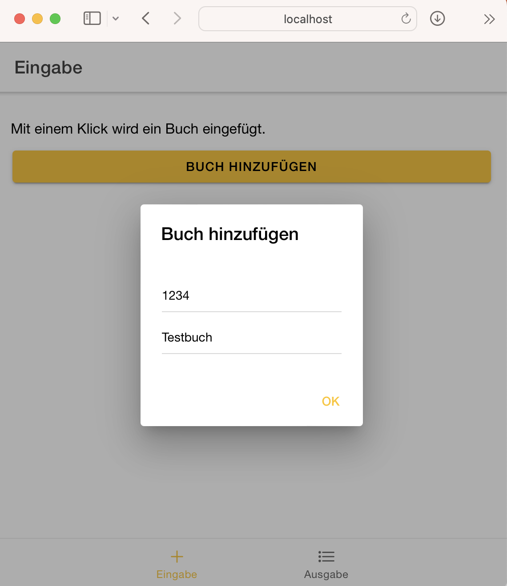
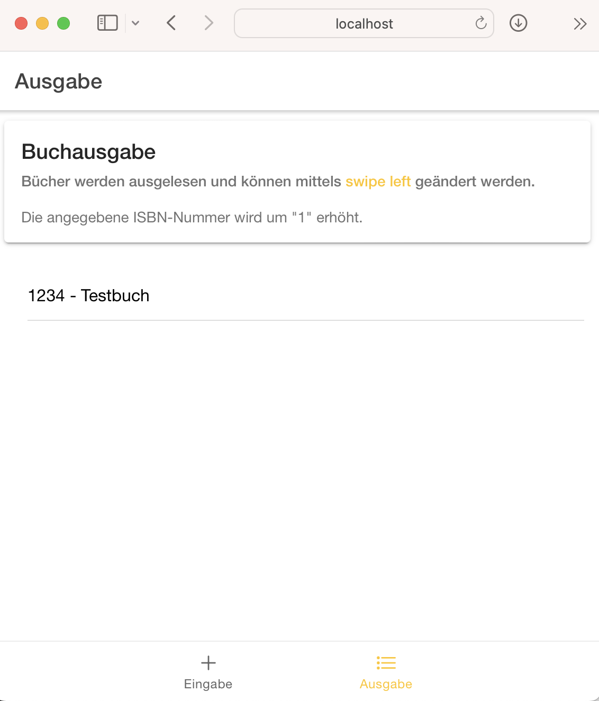
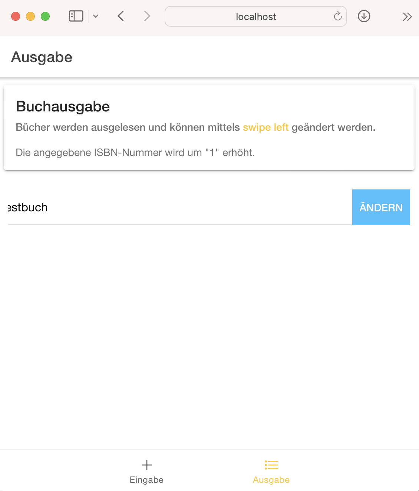
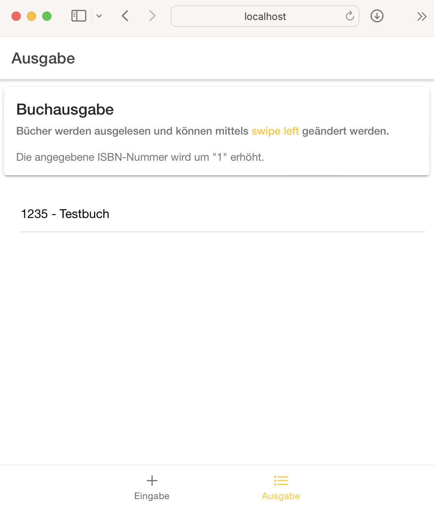

# Bücher

In diesem Projekt wird `PouchDB` mit dem `Ionic Framework` verwendet. 

- <https://pouchdb.com>
- <https://ionicframework.com>

Bücher können hinzugefügt und ausgegeben werden. In einer `ion-list` kann die ISBN-Nummer für Demozwecke verändert werden.

Folgende Bereiche wurden ignoriert:

- Validierung,
- ISBN-Nummer kann und soll logischerweise nicht "erhöht" werden (im Projekt ist dies aus Demozwecken aber möglich),
- zusätzliche Attribute

**Achtung:** Es handelt sich um ein **Demo-Projekt**. Das Projekt erhebt keinen Anspruch auf Vollständigkeit.

## Screenshots

